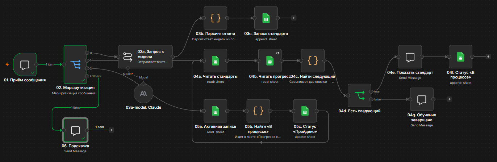

# n8n Casual Automation

Кейс автоматизации бизнес-процесса: **онбординг сотрудников кофейни через чат-бота на n8n Cloud с AI-агентом**.

Демонстрирует полный цикл работы бизнес-аналитика и автоматизатора: от анализа проблемы до внедрения работающей системы.

## Проблема

У сети кофеен «Casual» открываются три новые точки. Стандарты работы (рецепты, оборудование, техпроцессы) существуют только «в головах» опытных баристов — они нигде не зафиксированы. Новых сотрудников приходится обучать вручную, каждый раз заново объясняя одно и то же.

**Задача:** создать систему, которая сохранит знания опытных сотрудников и автоматически обучит новых по единым стандартам.

## Решение

Разработана система на n8n Cloud с тремя режимами работы:

1. **Сохранение стандарта.** Опытный барист пишет боту: «стандарт: описание процесса». AI-модель структурирует текст в JSON с полями `name`, `description`, `equipment` и записывает в Google Sheets.

2. **Обучение.** Новый сотрудник пишет «обучение». Бот берёт первый непройденный стандарт из таблицы, показывает его, фиксирует статус «В процессе» в листе «Прогресс».

3. **Отметка о прохождении.** Сотрудник пишет «готово». Система обновляет статус на «Пройдено» и автоматически показывает следующий стандарт. Когда всё изучено — поздравляет.

Дополнительно: **Fallback** — вежливый ответ на любые непонятные сообщения.

## Схема workflow

```
Chat Trigger → Switch (маршрутизация по ключевым словам)
    ├── «стандарт» → Basic LLM Chain → Code (парсинг) → Google Sheets (запись)
    ├── «обучение» → Google Sheets (чтение) → Code (поиск) → If
    │                                                       ├── True  → Chat (показать) → Google Sheets (в процессе)
    │                                                       └── False → Chat (завершено)
    ├── «готово»   → Google Sheets (чтение) → Code (найти активную) → Google Sheets (обновить)
    │                                                       └── возврат в ветку «обучение»
    └── Fallback   → Chat (подсказка)
```

### Визуализация workflow



## Технический стек

| Инструмент | Назначение |
| --- | --- |
| **n8n Cloud** | Оркестрация всего workflow |
| **Basic LLM Chain** | Обработка текста через Claude Sonnet 5 (Gateway credits) |
| **Google Sheets API** | База знаний (лист «Стандарты») и прогресс (лист «Прогресс») |
| **JavaScript (Code узлы)** | Парсинг ответа модели, сравнение списков, поиск активных записей |

## Ключевые особенности реализации

- **AI-структурирование.** Модель принимает свободный текст и возвращает валидный JSON. System Prompt задан через Chat Messages (роль System).
- **Защита от HTML-мусора.** Функция `cleanText()` удаляет `<br>`, `<p>` и другие теги, которые модель иногда добавляет в ответ. Работает в двух узлах — при записи и при показе.
- **Устойчивость к невидимым символам.** Функция `getField()` ищет поля «Статус» и «Сотрудник» с учётом регистра и скрытых символов, которые Google Sheets иногда добавляет в значения.
- **Безопасная вставка текста в JSON.** Используется `JSON.stringify()` — это защищает от поломки JSON, если пользователь ввёл текст с кавычками.
- **Идентификация по sessionId.** Вместо имени (которое можно подделать) система использует уникальный идентификатор сессии из Chat Trigger.
- **Автоматическое закрытие цикла.** После отметки «Пройдено» поток возвращается в начало, проверяет наличие непройденных стандартов и показывает следующий.

## Результаты

| Показатель | До автоматизации | После |
| --- | --- | --- |
| Время на онбординг одного сотрудника | 20–30 минут (ручное объяснение) | ~5 минут (бот + самостоятельное изучение) |
| Риск потери знаний при увольнении | Высокий | Минимальный (всё в таблице) |
| Повторные вопросы от новичков | Постоянно | Минимально (бот отвечает сам) |
| Единообразие стандартов | Отсутствует | Гарантировано |

**Estimated time saved:** 5 минут на каждое выполнение (настроено в параметрах workflow).

## Что демонстрирует проект

- Навыки **бизнес-анализа:** выявление проблемы, проектирование процесса, декомпозиция на шаги.
- Навыки **автоматизации:** построение сложного workflow с ветвлениями, циклами и обработкой ошибок.
- Работу с **AI в бизнесе:** интеграция LLM, проектирование System Prompt, структурирование ответа.
- **Работа с данными:** чтение и запись в Google Sheets, сравнение списков, работа со статусами.
- **Устойчивость к сбоям:** обработка невалидного JSON, HTML-тегов, невидимых символов, пустых результатов.

## Файлы проекта

- `workflow.json` — экспорт workflow из n8n Cloud (для импорта в собственный инстанс).
- `images/` — скриншоты интерфейса: workflow, чат, Google Sheets.

## Автор

**Sergey Grechkin**
- GitHub: [@Puzz1eAssemb1er](https://github.com/Puzz1eAssemb1er)
