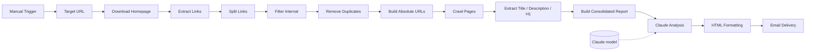

# n8n SEO Auditor

> Automated on-page SEO audit workflow built in **n8n**. The workflow discovers internal URLs from a site's homepage, crawls the discovered pages, extracts `Title`, `meta description` and `H1`, prepares a consolidated dataset, sends it to **Claude** for analytical interpretation, converts the result to styled HTML and delivers the final report by email.

## Overview

**Input:** target website URL  
**Process:** discover → filter → deduplicate → crawl → extract → aggregate → analyze → format → deliver  
**Output:** structured SEO audit report delivered by email

The workflow separates deterministic processing from LLM interpretation: n8n performs URL discovery, filtering, crawling, extraction and aggregation; Claude interprets the collected metadata and produces recommendations.

## Architecture



## Workflow stages

| Stage | Responsibility |
|---|---|
| Trigger / configuration | Start execution and define `baseUrl` |
| Discovery | Download homepage and extract links |
| Filtering | Keep internal URLs and remove duplicates |
| Normalization | Convert relative URLs to absolute URLs |
| Crawling | Request discovered pages |
| Extraction | Collect `title`, `description`, `h1` |
| Aggregation | Build one bounded analytical dataset |
| AI analysis | Identify issues and formulate recommendations |
| Presentation | Convert Markdown response to HTML |
| Delivery | Send the report by email |

## Node map

- `▶️ Запуск аудита` — manual start
- `🌐 Адрес сайта` — target `baseUrl`
- `📥 Скачать главную страницу` — homepage HTTP request
- `🔗 Собрать ссылки` — extracts `a[href]`, `title`, `description`, `h1`
- `📋 Разбить на список` — fans links out into individual items
- `🧹 Фильтр ссылок` — keeps internal/relative links
- `🔂 Убрать дубли` — removes duplicate raw URLs
- `🔧 Сделать полные адреса` — creates `fullUrl`
- `📥 Скачать все страницы` — crawls discovered pages
- `🏷️ Извлечь мета-теги` — extracts page metadata
- `📝 Собрать отчёт` — aggregates page-level data
- `🤖 Анализ Claude AI` — LLM-based SEO interpretation
- `🧠 Модель Claude` — model provider
- `🎨 Оформить HTML` — Markdown-to-HTML transformation
- `✉️ Отправить на email` — report delivery

## Data flow

A normalized crawl target is represented by `fullUrl`. Each crawled page produces:

```json
{
  "title": "...",
  "description": "...",
  "h1": "..."
}
```

The aggregation stage adds character counts for `title` and `description` and builds the consolidated input for Claude.

## AI responsibility

Claude is instructed to analyze:

1. overall statistics;
2. missing, short, long or duplicate `Title` values;
3. missing, short, long or duplicate descriptions;
4. missing or duplicate H1 values;
5. concrete corrective actions.

The AI layer is intentionally downstream of deterministic extraction. It does not receive raw website HTML as its primary input.

## Current scope

This is an **on-page SEO metadata auditor / MVP crawler**, not a complete technical SEO crawler.

Currently covered:

- homepage link discovery;
- internal-link filtering;
- URL deduplication;
- page crawling;
- `Title` extraction;
- `meta description` extraction;
- `H1` extraction;
- character counts;
- AI-assisted interpretation;
- HTML email report.

Not currently covered:

- recursive multi-level crawling;
- `robots.txt` / `sitemap.xml` analysis;
- canonical validation;
- `noindex` / `nofollow` analysis;
- redirect-chain reporting;
- image `alt` coverage;
- Core Web Vitals;
- first-class HTTP status dataset.

## Known technical limitations

1. Raw URLs are deduplicated before absolute URL normalization. Equivalent relative and absolute URLs can therefore survive as separate crawl targets.
2. Homepage and page-crawl requests use different timeout values.
3. Crawl scope is based on links found on the homepage; it is not recursive.
4. Page-download errors are configured to continue, but there is no dedicated error-reporting branch in the current graph.
5. SEO length classification is currently delegated to the LLM rather than enforced by deterministic threshold rules.

These limitations are documented deliberately as part of the current MVP design.

## Installation

1. Import `workflows/seo-auditor.json` into n8n.
2. Configure the Anthropic/Claude credential.
3. Configure the Gmail credential.
4. Set the target URL in `🌐 Адрес сайта`.
5. Run `▶️ Запуск аудита`.

The repository export is sanitized: credentials, personal recipient data and instance-specific metadata are not included.

## Portfolio value

The project demonstrates workflow orchestration, HTTP integration, HTML parsing, JavaScript data transformation, filtering/deduplication, LLM integration, prompt design, report generation and automated delivery. From a Business Analyst / AI-automation perspective, the key artifact is the explicit transformation of a manual audit task into a repeatable process with defined input, processing stages and output.

## Security

Never commit API keys, OAuth tokens, exported credentials or personal test data. Use n8n's credential mechanism and placeholders in public examples.

## Repository structure

```text
projects/seo-auditor/
├── README.md
├── workflows/
│   └── seo-auditor.json
├── docs/
│   ├── architecture.md
│   ├── workflow.md
│   └── technical-notes.md
└── examples/
    └── report-schema.md
```
